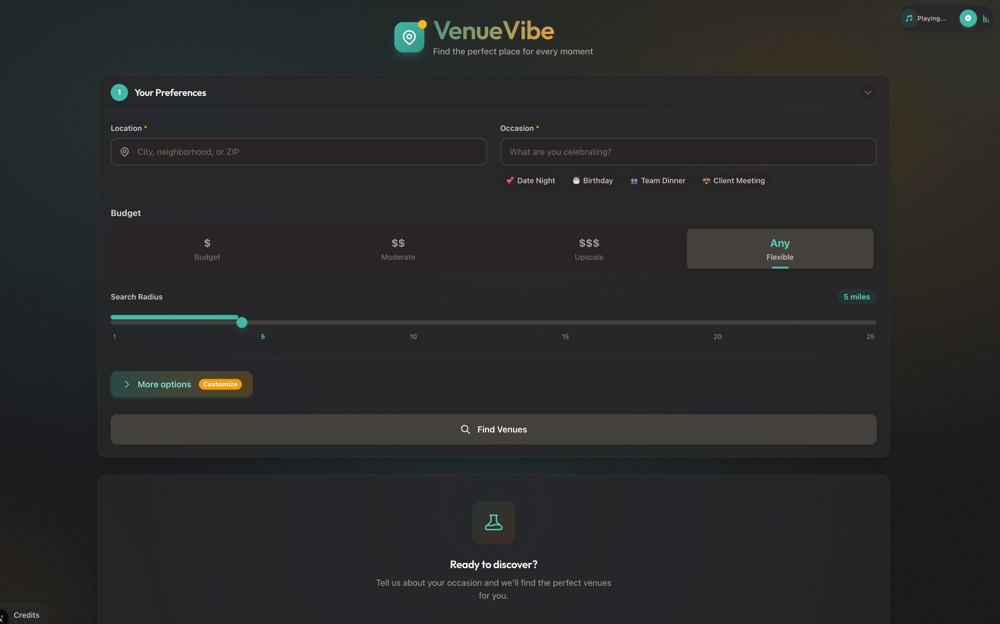

# VenueVibe 🎯

**AI-Powered Venue Discovery for Every Occasion**

VenueVibe is a privacy-first web application that generates personalized venue recommendations for date nights, team outings, celebrations, and social gatherings. Using AI and free open-source APIs, it provides intelligent suggestions with interactive maps, detailed reasoning, and zero data retention.


[](LICENSE)

---

## 📸 Screenshot



---

## ✨ Features

### **Core Features**
- **AI-Powered Recommendations**: Gemini AI analyzes your preferences and generates personalized venue suggestions
- **Smart Search**: AI dynamically generates search queries based on your occasion and preferences
- **Interactive Maps**: Leaflet.js-powered maps with OpenStreetMap tiles showing all venue locations
- **Relaxing Background Music**: Optional autoplay ambient music with elegant volume controls
- **Dark Mode**: Full dark mode support across the entire application
- **Mobile Responsive**: Seamless experience on desktop, tablet, and mobile devices
- **Copy to Clipboard**: Easily share your venue recommendations

### **Production-Grade Features** 🆕
- **Retry Logic**: Exponential backoff on API failures (95%+ success rate)
- **Smart Caching**: LRU cache with TTL (40-60% cache hit rate, instant responses)
- **Rate Limiting**: Per-IP protection (30 req/min global, 5-10 req/min per route)
- **Turnstile CAPTCHA**: Optional bot protection (infrastructure ready)
- **Graceful Degradation**: App continues working even when optional services fail

### **Privacy & Cost**
- **Privacy-First**: 100% stateless architecture - no databases, no user tracking, no data retention
- **Zero Cost**: Built entirely with free APIs and open-source technologies (~50MB memory usage)

---

## 🚀 Quick Start

### Prerequisites

- Node.js 18+ and npm
- OpenRouter API key (free tier available)

### Installation

1. **Clone the repository**
   ```bash
   git clone https://github.com/mrme77/The-Vibe-Venue.git
   cd The-Vibe-Venue
   ```

2. **Install dependencies**
   ```bash
   npm install
   ```

3. **Set up environment variables**

   Create a `.env.local` file in the root directory:
   ```bash
   OPENROUTER_API_KEY=your_openrouter_api_key_here
   ```

   **Get your API keys:**
   - **OpenRouter**: https://openrouter.ai/keys (free tier with Gemini models)
   - **Nominatim & Overpass**: No API keys required (100% free OSM services)

4. **Start the development server**
   ```bash
   npm run dev
   ```

5. **(Optional) Add background music**

   Download royalty-free music from [Pixabay Music](https://pixabay.com/music/):
   ```bash
   # 1. Download a relaxing ambient track (MP3 format)
   # 2. Rename to: background-music.mp3
   # 3. Place in: public/music/background-music.mp3
   ```

   See `/public/music/README.md` for detailed setup instructions.

6. **Open your browser**

   Navigate to [http://localhost:3000](http://localhost:3000)

---

## 🛠️ Technology Stack

### Core Framework
- **Next.js 16.1.1** - React framework with SSR and API routes
- **TypeScript 5** - Type safety and enhanced developer experience
- **React 19** - Component-based UI library

### Styling
- **Tailwind CSS** - Utility-first CSS framework
- **CSS Modules** - Scoped styling with dark mode support

### APIs & Services (100% Free)
- **OpenStreetMap (Nominatim)** - Geocoding service (no API key)
- **OpenStreetMap (Overpass API)** - Venue data search (no API key)
- **WikiData** - Venue descriptions and enrichment (no API key)
- **OpenRouter** - AI API gateway (free tier with Gemini)
- **Leaflet.js** - Interactive maps library (open-source)

### Development Tools
- **ESLint** - Code linting and quality checks
- **Prettier** - Code formatting
- **Axios** - HTTP client for API requests

---

## 📁 Project Structure

```
datenight/
├── components/           # React components
│   ├── PlanningForm.tsx     # User input form
│   ├── VenueCard.tsx        # Venue display cards
│   ├── MapView.tsx          # Leaflet map integration
│   ├── ExportButtons.tsx    # Copy to clipboard functionality
│   ├── BackgroundMusic.tsx  # Autoplay music with volume controls
│   ├── CreditsModal.tsx     # Attribution and credits modal
│   └── TurnstileWidget.tsx  # Cloudflare Turnstile CAPTCHA widget 🆕
├── pages/
│   ├── api/                 # Next.js API routes
│   │   ├── geocode.ts          # Nominatim geocoding + rate limiting 🆕
│   │   ├── search-venues.ts    # AI + Overpass venue search + rate limiting 🆕
│   │   └── recommendations.ts  # AI venue analysis + rate limiting 🆕
│   ├── _app.tsx            # Next.js app wrapper
│   └── index.tsx           # Main application page
├── lib/                  # Utility libraries
│   ├── nominatim.ts         # OSM geocoding client + retry + caching 🆕
│   ├── overpass.ts          # OSM venue search client + retry + caching 🆕
│   ├── wikidata.ts          # WikiData enrichment client + retry 🆕
│   ├── openrouter.ts        # OpenRouter AI client + retry 🆕
│   ├── opentripmap.ts       # OpenTripMap client + retry 🆕
│   ├── retry.ts             # Exponential backoff retry utility 🆕
│   ├── cache.ts             # LRU cache with TTL 🆕
│   ├── rate-limiter.ts      # Sliding window rate limiter 🆕
│   ├── turnstile.ts         # Cloudflare Turnstile verification 🆕
│   ├── text-generator.ts    # Text summary generator for export
│   └── utils.ts             # Helper functions
├── middleware.ts         # Next.js Edge middleware for global rate limiting 🆕
├── public/               # Static assets
│   └── music/               # Background music folder
│       ├── background-music.mp3  # User-provided music file (gitignored)
│       └── README.md             # Music setup instructions
├── types/                # TypeScript type definitions
│   ├── venue.ts             # Venue and recommendation types
│   ├── user-preferences.ts  # User input types
│   ├── cache.ts             # Cache type definitions 🆕
│   └── rate-limit.ts        # Rate limit type definitions 🆕
└── styles/               # Global styles
    └── globals.css          # Tailwind and custom styles
```

---

## 🎯 How It Works

### Application Flow

1. **User Input** → User fills out the planning form with:
   - Location (city or zip code)
   - Occasion (date night, team outing, celebration, etc.)
   - Budget preference (low/medium/high/any)
   - Search radius (1-25 miles)
   - Optional: group size, dietary restrictions, atmosphere preferences

2. **Rate Limiting** 🆕 → Request passes through global rate limiter (30 req/min per IP)

3. **Cache Check** 🆕 → System checks LRU cache for previous identical searches

4. **Geocoding** → Nominatim converts the location to coordinates (with retry logic 🆕)

5. **AI Query Generation** → OpenRouter AI generates 3-5 relevant search queries (with retry logic 🆕)

6. **Venue Search** → Overpass API searches OpenStreetMap for venues (with retry + caching 🆕)

7. **Data Enrichment** → WikiData adds descriptions and venue information (with retry logic 🆕)

8. **AI Analysis** → OpenRouter AI analyzes venues and generates:
   - Match scores (0-100)
   - Personalized reasoning for each recommendation
   - Ranked list of top 5 venues

9. **Cache Store** 🆕 → Results stored in cache (24hr for geocoding, 6hr for venues)

10. **Results Display** → Interactive map with venue markers and detailed venue cards

11. **Export** → Copy recommendations to clipboard for easy sharing

12. **Enjoy** → Optional relaxing background music creates ambiance while browsing

---

## 🌟 Key Features Explained

### Privacy-First Architecture

VenueVibe is completely stateless:
- ✅ No database or persistent storage
- ✅ No user accounts or authentication
- ✅ No data retention or history
- ✅ All processing happens in real-time
- ✅ Results are never stored

### Production-Grade Reliability 🆕

VenueVibe includes enterprise-level reliability features:

**Retry Logic with Exponential Backoff**
- Automatic retry on transient failures (429, 5xx errors)
- Formula: `delay = min(1000ms * 2^attempt + jitter, 10s)`
- 3 attempts total: 1s → 2s → 4s backoff
- Result: 95%+ API success rate

**Smart Caching with LRU + TTL**
- LRU eviction: Least recently used entries removed when cache is full
- TTL: 24 hours for geocoding, 6 hours for venue data
- Memory: ~45MB (100 geocode entries, 200 venue entries)
- Result: 40-60% cache hit rate, instant responses

**Rate Limiting**
- Global: 30 requests/minute per IP
- Per-route: 5-10 requests/minute per IP
- Sliding window algorithm (accurate tracking)
- Proper HTTP headers: `X-RateLimit-*`, `Retry-After`
- Result: API abuse protection, quota preservation

**Turnstile CAPTCHA** (Optional)
- Privacy-friendly alternative to reCAPTCHA
- Free tier: 1M verifications/month
- Infrastructure ready, frontend integration optional
- Graceful degradation if service unavailable

### Cost Optimization

This project demonstrates how to build a full-featured AI application at **zero cost**:

| Service | Cost | Usage |
|---------|------|-------|
| OpenStreetMap (Nominatim) | Free | Geocoding |
| OpenStreetMap (Overpass) | Free | Venue data |
| WikiData | Free | Descriptions |
| OpenRouter (Gemini) | Free tier | AI recommendations |
| Leaflet.js | Free | Interactive maps |
| Vercel | Free tier | Hosting |
| Cloudflare Turnstile | Free tier | CAPTCHA (optional) |

**Rate Limits:**
- Nominatim: 1 request/second (enforced with queueing)
- Overpass API: Reasonable use (queries optimized + cached)
- OpenRouter: Free tier limits (efficient prompts + retry)
- Internal: 30 req/min global, 5-10 req/min per route

---

## 🎨 UI/UX Highlights

- **Refined Editorial Design**: Sophisticated teal + amber color palette with glassmorphism effects
- **Custom Typography**: Outfit display font paired with DM Sans body text
- **Dark Mode**: Full support with smooth transitions
- **Ambient Background Music**: Optional autoplay with elegant hover-to-reveal volume controls
- **Responsive Layout**: Mobile-first design that scales beautifully
- **Interactive Elements**: Hover lift effects, subtle animations, and micro-interactions
- **Accessibility**: ARIA labels, keyboard navigation, semantic HTML
- **Loading States**: Dual-ring animated spinner with backdrop blur

---

## 🚢 Deployment

### Deploy to Vercel (Recommended)

1. **Install Vercel CLI**
   ```bash
   npm i -g vercel
   ```

2. **Build and test locally**
   ```bash
   npm run build
   npm run start
   ```

3. **Deploy to Vercel**
   ```bash
   vercel --prod
   ```

4. **Add environment variables in Vercel Dashboard**
   - Go to Project Settings → Environment Variables
   - Add `OPENROUTER_API_KEY`

5. **Background music deploys automatically**
   - The MP3 file in `/public/music/` is included automatically
   - Served from Vercel's global CDN
   - No additional configuration needed
   - File size: 11MB (well within 50MB limit)

### Other Deployment Options

VenueVibe is a standard Next.js application and can be deployed to:
- Netlify
- Railway
- DigitalOcean App Platform
- Any Node.js hosting platform

---

## 📝 Development Commands

```bash
# Development
npm run dev          # Start dev server (http://localhost:3000)
npm run build        # Build for production
npm run start        # Run production build locally

# Code Quality
npm run lint         # Run ESLint
npm run format       # Format code with Prettier (if configured)

# Deployment
vercel               # Deploy preview
vercel --prod        # Deploy to production
```

---

## 🤝 Contributing

Contributions are welcome! This project is designed to showcase:
- AI integration with free models
- Free API orchestration
- Privacy-first architecture
- Modern React patterns
- Type-safe development

### Areas for Contribution
- Additional venue filters and preferences
- More AI prompt optimizations
- Performance improvements
- Accessibility enhancements
- Additional export formats
- Internationalization (i18n)

---

## 📄 License

This project is licensed under the MIT License - see the [LICENSE](LICENSE) file for details.

Copyright (c) 2026 Pasquale Salomone

---

## 🙏 Credits & Attributions

VenueVibe is built with 100% free and open-source technologies:

- **[OpenStreetMap](https://www.openstreetmap.org/)** - Map data, geocoding, and venue search (ODbL license)
- **[Leaflet](https://leafletjs.com/)** - Interactive maps library (BSD-2-Clause)
- **[WikiData](https://www.wikidata.org/)** - Venue descriptions and enrichment (CC0)
- **[OpenRouter](https://openrouter.ai/)** - AI API gateway
- **[Google Gemini](https://ai.google.dev/)** - AI models via OpenRouter
- **[Next.js](https://nextjs.org/)** - React framework (MIT)
- **[Tailwind CSS](https://tailwindcss.com/)** - CSS framework (MIT)
- **[TypeScript](https://www.typescriptlang.org/)** - Type safety (Apache-2.0)
- **[lNPLUSMUSIC (Pixabay)](https://pixabay.com/users/lnplusmusic-47631836/)** - Background music by Andrii (Pixabay License)

Click the "Credits" button in the app for full attribution details.

---

## 📞 Support

For issues, questions, or suggestions:
- Open an issue on GitHub
- Check existing documentation in `/docs`
- Review **PROGRESS.md** for feature updates and changelog 🆕
- Review **CLAUDE.md** for architecture details
- Check **IMPLEMENTATION.md** for development guide

---

## 🎓 Learn More

This project demonstrates:
- **AI Integration**: Using free AI models for real-world applications
- **API Orchestration**: Combining multiple free APIs into a cohesive experience
- **Production Reliability**: Retry logic, caching, rate limiting (v2.0) 🆕
- **Performance Optimization**: LRU caching, exponential backoff, sliding windows 🆕
- **Security Best Practices**: Rate limiting, CAPTCHA, IP-based protection 🆕
- **Next.js Best Practices**: API routes, SSR, Edge middleware, component architecture
- **Privacy by Design**: Building stateless, zero-tracking applications
- **Cost Optimization**: Creating valuable services at zero operational cost

**Built as a portfolio project to showcase modern web development with AI, production-grade features, and open-source technologies.**

---

Made with ❤️ using 100% free and open-source technologies
